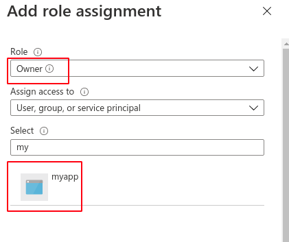

# Azure Example - Create a resource group using Terraform Cloud

[Terraform Cloud Getting Started Guide](https://docs.microsoft.com/en-us/azure/developer/terraform/)

These are  the steps to get a terraform cloud working with your Azure subscription.

## Clone this repo
Clone this repo. It has the basic configuration to create an Azure resource group and an Azure VNET.

## Create a new Workspace in Terraform Cloud
Login to you Terraform Cloud and create a new workspace. Choose "Version control workflow". We choose this since we will store our configurations in git and runs will get triggered based on any changes to the git repo.

## Create an user identity for Terraform Cloud application in Azure AD.

In Azure Active Directory (Azure AD), the term [app provisioning](https://docs.microsoft.com/en-us/azure/active-directory/app-provisioning/user-provisioning) refers to automatically creating user identities and roles for applications.

In our case, we need to create a new service principal to represent the Terraform Cloud application. This service principal will have an owner access to our subscription so that in can provision resources in it.

To do that, navigate to "App registrations" as shown below. Click on "new registration".

Give you app any name and create it. See the values used in this example below:

After it is created, you need to add Client credentials. Click on the "Certificates & secrets" in the Manage section as shown below

Click on the "New client secret" button and follow the prompts. When you are done, you will be presented with an auto generated password that you must save. This is the password you will configure in Terraform cloud for authentication.

## Assign role in the desired Azure subscription

Now we need to make sure that this service principal has access to the subscription for creating and deleting resources in it.

Navigate to your subscription and do the role assignment as shown below.

Click on Add and select "Add role assignment" and follow the instructions. See below for how your screen would look like:

Go back to your subscription and refresh the page. Verify that the subscription now has a role of "owner" assigned.

## Set up Terraform Cloud workspace variables

Go back to your Terraform Cloud workspace and configure the Environment variables as shown below. All these values will be available to you from the Azure app that you created above. Client secret is only available at creation time - if you forgot to copy it, create a new one.

## Trigger a dry run

From your Terraform Cloud workspace, trigger a new run. The output will look something like this, if everything went well.

## Apply the changes

If everything looks good, its time to apply the changes. Click on "Confirm and apply". Go back to Azure and verify that your resources are now created.

## Using variables.

In this example, there are two variables defined in [variables.tf](./variables.tf). If you do not like the defaults, you can pass your own values by setting the variables in your workspace as shown below.

